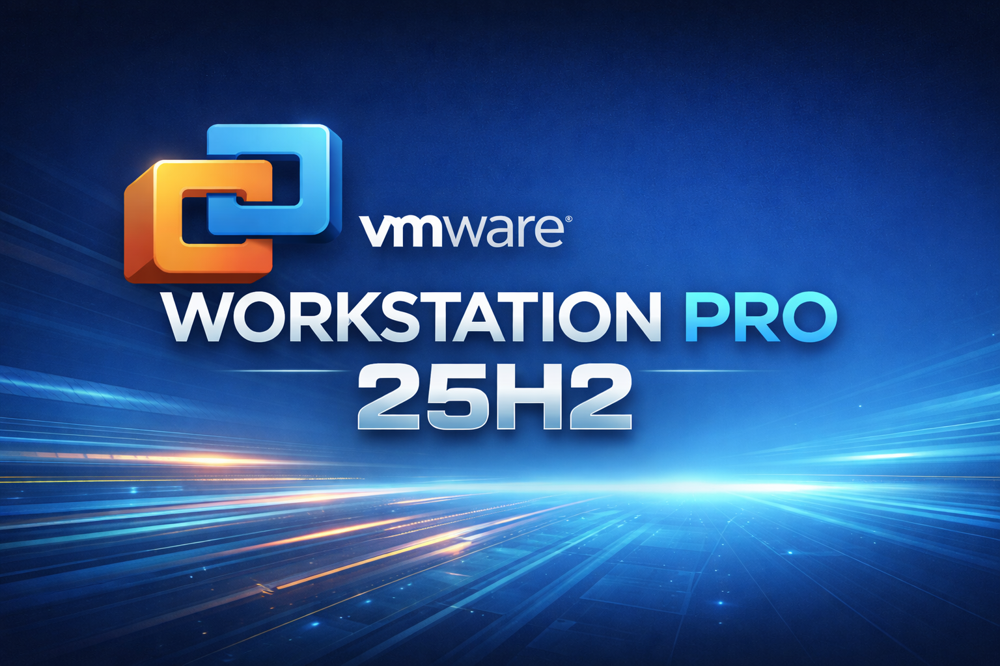

## VMware Workstation Pro and Fusion 25H2
VMware Workstation Pro 25H2 and VMware Fusion Pro 25H2 provide professional desktop virtualization for Windows, Linux, and macOS. This release is perfect for learning virtualization, giving students, IT professionals, and enthusiasts hands-on experience with real-world setups. The full Pro feature set is fully unlocked, with no license key required, and now free for commercial, educational, and personal use. It’s an ideal platform to build practical skills in system administration, networking, and software testing, while exploring virtualization technologies safely and efficiently.

---

## Key Features

| Feature | Description |
|-------|-------------|
| **Run Multiple VMs** | Run several virtual machines simultaneously on a single system without performance bottlenecks. |
| **Advanced Networking** | Design, simulate, and test complex virtual networks for development, training, or labs. |
| **Snapshots & Clones** | Instantly save VM states or clone environments to speed up testing and recovery. |
| **Optimized Performance** | Intelligent resource allocation ensures smooth performance under demanding workloads. |
| **Secure Isolation** | Keep virtual machines isolated to protect the host OS and maintain system security. |
| **Cross-Platform Support** | Supports Windows and Linux hosts with compatibility across many guest operating systems. |
| **Container Integration** | Integrates with Docker and Kubernetes workflows inside virtualized environments. |

---

## System Requirements for VMware Workstation Pro / Fusion 25H2

### Minimum System Requirements

| Component | Windows | macOS | Linux |
|----------|--------|-------|-------|
| **OS** | Windows 10 or Windows 11 (64-bit) | macOS 15 Sequoia or later (Intel or Apple Silicon) | 64-bit Linux (RHEL 10, Fedora 42, Debian 13, openSUSE Leap 16, SUSE Linux 16, or equivalent) |
| **Processor** | 64-bit Intel or AMD CPU with VT-x or AMD-V | Intel or Apple Silicon with virtualization support | 64-bit Intel or AMD CPU with VT-x or AMD-V |
| **RAM** | 2 GB | 8 GB | 2 GB |
| **Storage** | ~1 GB for application + 20 GB per VM | ~1 GB for application + 20 GB per VM | ~1 GB for application + 20 GB per VM |
| **Internet** | Required for install, updates, and activation | Required for install, updates, and activation | Required for install, updates, and kernel modules |

## Recommended System Requirements (Optimal Performance)
### Recommended System Requirements

| Component | Windows | macOS | Linux |
|----------|--------|-------|-------|
| **OS** | Windows 11 (64-bit) | Latest macOS release supported by Fusion | Latest supported 64-bit Linux distribution |
| **Processor** | Multi-core Intel or AMD CPU with VT-x or AMD-V | Apple Silicon (M1/M2/M3) or modern Intel CPU | Multi-core Intel or AMD CPU with VT-x or AMD-V |
| **RAM** | 8–16 GB or more | 16 GB or more | 8–16 GB or more |
| **Storage** | SSD recommended, 40 GB+ free per VM | SSD recommended, 40 GB+ free per VM | SSD recommended, 40 GB+ free per VM |
| **Internet** | Persistent connection for updates and downloads | Persistent connection for updates and downloads | Persistent connection for updates and build dependencies |

---

##How to obtain **VMware Workstation Pro 25H2**
As Broadcome now offers VMware Workstation Pro and Fusion 25H2 free for personal and commerical use without a traditional paid license key. 

1. Go to the Broadcom Support Registration Page
- Open your browser and visit: [https://profile.broadcom.com/web/registration](https://profile.broadcom.com/web/registration). Proceed to complete the registration process. 

2. After registering, go to [https://support.broadcom.com](https://support.broadcom.com)  and log in with your new account credentials.
   
3. Navigate to VMware Downloads
- In the **top right**, pick **“VMware Cloud Foundation”** from any dropdown if visible. 
Support Portal
- Go to **My Downloads** → find the link named **“Free Software Downloads available HERE”**.

- In the Search box, type **“Workstation Pro”**

- In the Search boc, you can also search **VMware Fusion** for macOS

4. Download the VMware Workstation Pro or VMware Fuision installer. Once installed, proceed to open the software and configure your virtual machines.

### External Links
- [VMWare Workstation and Fuision Product Overview](https://www.vmware.com/products/desktop-hypervisor/workstation-and-fusion#product-overview)
- [VMware Worksation and Fusion 25H2 New Features](https://blogs.vmware.com/cloud-foundation/2025/10/14/vmware-workstation-fusion-25h2-embracing-calendar-versioning-and-new-features/)

### Download ISO Files

**Linux ISO**
- [Fedora] (https://www.fedoraproject.org/)
- [Linux Mint 22.2 'Zara'](https://linuxmint.com/download.php)
- [Manjaro](https://manjaro.org/products)
- [Ubuntu 24.04 & Ubuntu 25.10](https://ubuntu.com/download/desktop)
- [Ubuntu Flavors](https://ubuntu.com/desktop/flavors)
- [Zorin OS 18 Core](https://zorin.com/os/download/)

**Windows ISO**
- [Windows 11](https://www.microsoft.com/en-us/software-download/windows11)

