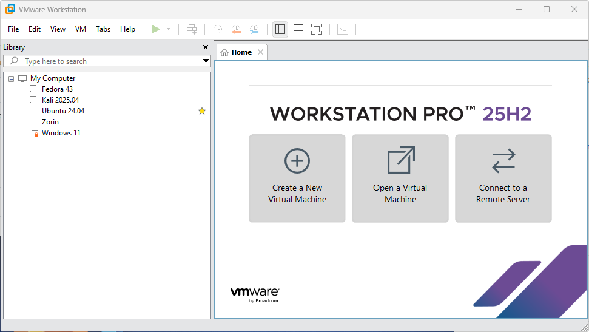

## VMware Workstation Pro and Fusion 25H2
VMware Workstation Pro 25H2 and VMware Fusion Pro 25H2 provide professional desktop virtualization for Windows, Linux, and macOS. This release is perfect for learning virtualization, giving students, IT professionals, and enthusiasts hands-on experience with real-world setups. The full Pro feature set is fully unlocked, with no license key required, and now free for commercial, educational, and personal use. It’s an ideal platform to build practical skills in system administration, networking, and software testing, while exploring virtualization technologies safely and efficiently.

---

## Key Features

| Feature | Description |
|-------|-------------|
| **Run Multiple VMs** | Run several virtual machines simultaneously on a single system without performance bottlenecks. |
| **Advanced Networking** | Design, simulate, and test complex virtual networks for development, training, or labs. |
| **Snapshots & Clones** | Instantly save VM states or clone environments to speed up testing and recovery. |
| **Optimized Performance** | Intelligent resource allocation ensures smooth performance under demanding workloads. |
| **Secure Isolation** | Keep virtual machines isolated to protect the host OS and maintain system security. |
| **Cross-Platform Support** | Supports Windows and Linux hosts with compatibility across many guest operating systems. |
| **Container Integration** | Integrates with Docker and Kubernetes workflows inside virtualized environments. |

---

## System Requirements

### Minimum System Requirements

| Component | Windows | macOS | Linux |
|----------|--------|-------|-------|
| **OS** | Windows 10 or Windows 11 (64-bit) | macOS 15 Sequoia or later (Intel or Apple Silicon) | 64-bit Linux (RHEL 10, Fedora 42, Debian 13, openSUSE Leap 16, SUSE Linux 16, or equivalent) |
| **Processor** | 64-bit Intel or AMD CPU with VT-x or AMD-V | Intel or Apple Silicon with virtualization support | 64-bit Intel or AMD CPU with VT-x or AMD-V |
| **RAM** | 2 GB | 8 GB | 2 GB |
| **Storage** | ~1 GB for application + 20 GB per VM | ~1 GB for application + 20 GB per VM | ~1 GB for application + 20 GB per VM |
| **Internet** | Required for install, updates, and activation | Required for install, updates, and activation | Required for install, updates, and kernel modules |

### Recommended System Requirements (Optimal Performance)

| Component | Windows | macOS | Linux |
|----------|--------|-------|-------|
| **OS** | Windows 11 (64-bit) | Latest macOS release supported by Fusion | Latest supported 64-bit Linux distribution |
| **Processor** | Multi-core Intel or AMD CPU with VT-x or AMD-V | Apple Silicon (M1/M2/M3) or modern Intel CPU | Multi-core Intel or AMD CPU with VT-x or AMD-V |
| **RAM** | 8–16 GB or more | 16 GB or more | 8–16 GB or more |
| **Storage** | SSD recommended, 40 GB+ free per VM | SSD recommended, 40 GB+ free per VM | SSD recommended, 40 GB+ free per VM |
| **Internet** | Persistent connection for updates and downloads | Persistent connection for updates and downloads | Persistent connection for updates and build dependencies |

---

## How to obtain **VMware Workstation Pro 25H2**
As Broadcom now offers VMware Workstation Pro and Fusion 25H2 free for personal and commerical use without a traditional paid license key. 

1. Go to the Broadcom Support Registration Page
- Open your browser and visit: [https://profile.broadcom.com/web/registration](https://profile.broadcom.com/web/registration). Proceed to complete the registration process. 

2. After registering, go to [https://support.broadcom.com](https://support.broadcom.com)  and log in with your new account credentials.
   
3. Navigate to VMware Downloads
- In the **top right**, pick **“VMware Cloud Foundation”** from any dropdown if visible. 
Support Portal
- Go to **My Downloads** → find the link named **“Free Software Downloads available HERE”**.

- In the Search box, type **“Workstation Pro”**

- In the Search boc, you can also search **VMware Fusion** for macOS

4. Download the VMware Workstation Pro or VMware Fuision installer. Once installed, proceed to open the software and configure your virtual machines.

---
### Quick Steps to Configure a VM in VMware Workstation Pro

Creating Virtual Machines can be done by by using the **New Virtual Machine** wizard found on the VMware Workstation Pro 25H2 Home Screen. 

 

#### 1. Launch VMware Workstation Pro
Open the software from your Start Menu (Windows) or app menu (Linux).  

#### 2. Create a New VM
Click **Create a New Virtual Machine** or go to **File → New Virtual Machine**.  

#### 3. Choose Configuration Type
- **Typical** (recommended) for most users  
- **Custom** if you need advanced options (hardware version, etc.)  

Click **Next**.  

#### 4. Select Installation Media
Pick how you want to install the guest OS:
- Installer disc  
- ISO image file  
- Install OS later  

Then click **Next**.  

#### 5. Select Guest OS
Choose the operating system you will install (e.g., Linux, Windows) and its version.  

#### 6. Name the VM & Choose Location
Give your VM a name and select where to save its files.  

#### 7. Set Disk Size
Choose the maximum disk size and whether to store the disk as a single file or split it into multiple files.  

#### 8. Finish & Create
Review the settings and click **Finish**. Your VM appears in the library.  

#### 9. Power On & Install OS
Select the VM and click **Power on this virtual machine**.  
Complete the operating system installation process.  

#### 10. Install VMware Tools (Recommended)
After the OS is installed, go to **VM → Install VMware Tools** to improve integration (mouse, display, drivers).  

---

### Optional Configurations

After creating the VM:
- **Hardware adjustments** (RAM, CPUs, network):  
  Right-click the VM → **Settings**.  

- **Networking options**:  
  NAT, Bridged, Host-only

--- 

### External Links
- [VMWare Workstation and Fuision Product Overview](https://www.vmware.com/products/desktop-hypervisor/workstation-and-fusion#product-overview)
- [VMware Worksation and Fusion 25H2 New Features](https://blogs.vmware.com/cloud-foundation/2025/10/14/vmware-workstation-fusion-25h2-embracing-calendar-versioning-and-new-features/)

### Download ISO Files

**Linux ISO**
- [Fedora](https://www.fedoraproject.org/)
- [Kali Linux Pre-Build Virutal Machines](https://www.kali.org/get-kali/#kali-virtual-machines)
- [Linux Mint 22.2 'Zara'](https://linuxmint.com/download.php)
- [Manjaro](https://manjaro.org/products)
- [Ubuntu 24.04 & Ubuntu 25.10](https://ubuntu.com/download/desktop)
- [Ubuntu Flavors](https://ubuntu.com/desktop/flavors)
- [Zorin OS 18 Core](https://zorin.com/os/download/)

**Kali Linux**
Kali Linux is a powerful, Debian-based Linux distribution designed for advanced penetration testing, ethical hacking, and cybersecurity research. [Kali Linux](https://www.kali.org/get-kali/#kali-virtual-machines) has pre-built virtual machines for [VMware](https://www.vmware.com/uk.html) and [VirtualBox](https://www.virtualbox.org/) available. These images have the default credentials "kali/kali".

**Windows ISO**
- [Windows 11](https://www.microsoft.com/en-us/software-download/windows11)

### VirtualBox
VirtualBox is a popular choice among developers and hobbyists due to its cost-effectiveness and ease of use across Windows 11, macOS, and Linux environments. 

- [VirtualBox](https://www.virtualbox.org/)
- [Ubuntu's VirtualBox Guide](https://ubuntu.com/tutorials/how-to-run-ubuntu-desktop-on-a-virtual-machine-using-virtualbox#1-overview)
- [Zorin's VirtualBox Guide](https://help.zorin.com/docs/getting-started/install-zorin-os-in-virtualbox/)

### VirtualBox
Hyper-V is a virtualization platform developed by Microsoft, designed primarily for Windows-based guests. Hyper-V is often used in enterprise environments, where Windows Server is the dominant OS.

- [Hyper-V Documentation](https://learn.microsoft.com/en-us/windows-server/virtualization/hyper-v/)
- [Windows Server Hyper-V and Virtualization](https://www.getyoureducation.net/course/windows-server-hyper-v-and-virtualization)

--- 
## Support This Project

If you find these guides helpful, consider supporting the project.

Your support helps:
- Maintain and update documentation
- Add new troubleshooting guides
- Improve clarity and accuracy

