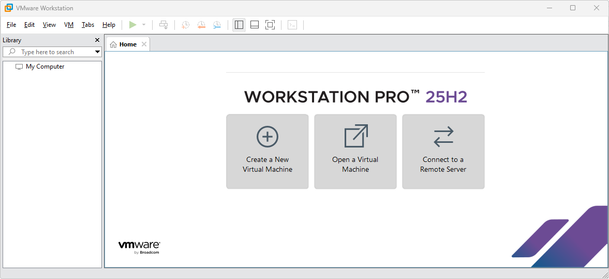
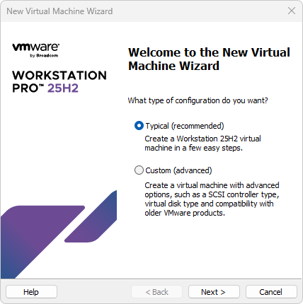
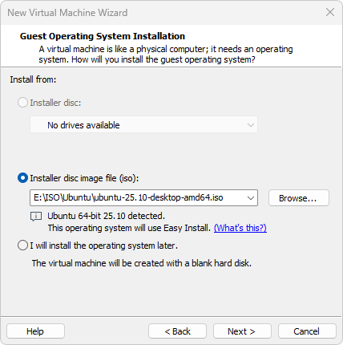
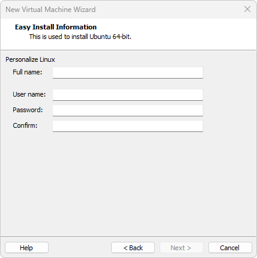
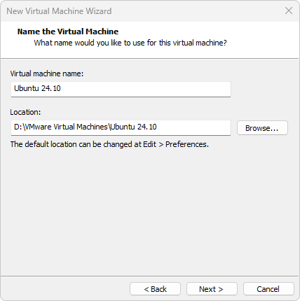
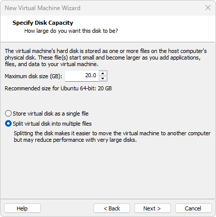

1. Proceed to select **Create a New Virtual Machine** 

2. For **New Virtual Machine Wizard**, select **Typical (recommended)** and click on **Next**

3. For the **Installer disc image file (iso), select browse and select the ISO that you wish to designate for this virtual machine. In this case scenario, **Ubuntu 25.10** will be setup.

4. Fill out **Easy Install Information** and select **Next** when ready. 

5. Proceed to name the virtual machine and confirm location to save the VM. 

6. Specify Disk Capacity and select **Next** when ready. Here VMware is recommending Ubuntu for 20 GB. Designate a higher maximum disk size according to your use-case scenario. 

7. Ready to Create Virtual Machine

